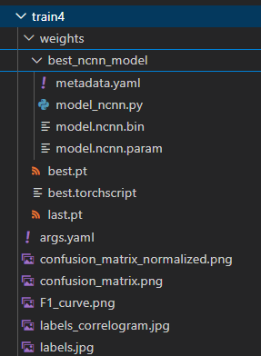

# Training
## Python environment
Ensure the environment is created
```
conda env create -f ../../conda-dev-environment.yml
```

## Env setup
You need to gather an API key from Roboflow.
1. Create an account
2. Create a workspace with public data plan
3. Go to https://app.roboflow.com/settings/api
4. Create and retrieve your Private API Key
5. Copy .env.template as .env
6. Set ROBOFLOW_API_KEY with your gathered key

## Build docker image
```
conda activate jedha-dsfs-ft-31-final-project-dev-env

dotenv -e .env docker build --build-arg ROBOFLOW_API_KEY -t yolo-train .
```

## Train and export
```
docker run --gpus all -it --rm -v ${pwd}/model:/model yolo-train
```

Adapt `${pwd}/model` depending on your environment.

In your `${pwd}/model` you will find one or more `train` subfolders.



- weithgs/best.pt is the best model regarding that training run
- weithgs/best_ncnn_model/ folder contains the exported model for RaspberryPi inference
